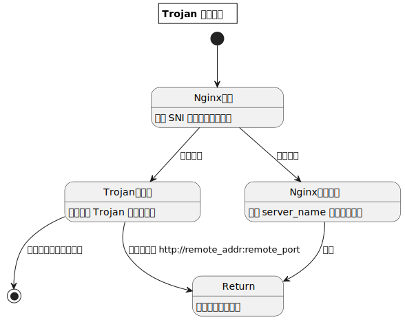

# Nginx

## 高性能反向代理服务器

### 静态文件共享服务器

默认访问，是 `403`，如果想把 `Nginx` 当作一个纯文件共享服务器，可以配置

```
autoindex on;
autoindex_exact_size off;
autoindex_localtime on;
```

### 自定义配置

把自定义配置文件挂载进 `/etc/nginx/conf.d`

### HTTP 服务

```
server {
  listen 80;
  server_name 域名;

  location / {
    root 路径;
    index index.html;
  }
}
```

### HTTPS 服务

```
server {
  listen 443 ssl;
  server_name 域名;
  ssl_certificate 证书;
  ssl_certificate_key 私钥;

  location / {
    root 路径;
    index index.html;
  }
}
```

### HTTP 状态码

比如不想返回内容，只想返回状态码

```
server {
  ...

  location / {
    return 403;
  }
}
```

### HTTPS 证书自动更新

`Let's Encrypt` 目前是用过比较好的服务，分分钟生成合法证书，虽然三个月后会过期，但是可以用 [nginxproxy/acme-companion](https://github.com/nginx-proxy/acme-companion) 和 [nginx-proxy](https://github.com/nginx-proxy/nginx-proxy) 实现自动续签，并且新服务仅需配置两个环境变量则可自动生成证书和完成反向代理的配置（更多有关 `nginxproxy` 的内容可以查看 [nginxproxy](../../nginxproxy)，该方式默认占用 `443` 端口，因此无法很好地与下面科学上网工具进行集成）

### 科学上网工具链

随着功夫网的日渐完善，魔法逐渐失效，一众老古董逐渐退出历史舞台，目前比较主流可用的是 `Trojan`，核心原理其实就是背后的特洛伊木马典故

- 在 `nginx.conf` 的 `events` 和 `http` 之间加入配置

  ```
  stream {
      map $ssl_preread_server_name $name {
          魔法域名 trojan-go;

          default reverse-proxy;
      }

      upstream trojan-go {
          server trojan-go:443;
      }

      upstream reverse-proxy {
          server reverse-proxy:443;
      }

      server {
          listen 443 reuseport;
          listen [::]:443 reuseport;
          proxy_pass $name;
          ssl_preread on;
      }
  }
  ```

  为了防止奇怪的问题，可以把 `80` 端口的访问强制到 `443`

  ```
  http {
      server {
          listen 80;
          return 301 https://$http_host$request_uri;
      }
  }
  ```

  `reverse-proxy`：`Nginx` 反代程序，其他服务监听 `443`，魔法服务监听 `80`

  `trojan-go`：科学上网程序（更多有关 `trojan-go` 的内容可以查看 [trojan-go](../../teddysun/trojan-go)）

  ```yml
  depends_on:
    - reverse-proxy
  ```

  `nginx`：入口程序

  ```yml
  depends_on:
    - reverse-proxy
    - trojan-go
  ```

- 如果访问 `HTTP`，就强转到 `HTTPS`

  - 一个访问其他服务的正常请求 -> [nginx:80] -> nginx:443 -> reverse-proxy:443 -> 其他服务

  - 一个访问魔法服务的正常请求 -> [nginx:80] -> nginx:443 -> trojan-go:443 -> reverse-proxy:80 -> 正常服务

  - 一个访问魔法服务的魔法请求 -> [nginx:80] -> nginx:443 -> trojan-go:443 -> 用魔法打败魔法

- 流量首先进入 `HTTPS` 服务

  - 如果是正常流量，访问正常服务，则返回该正常服务
  - 如果是正常流量，但是访问魔法服务（可能是真的有访问需求，或者功夫网主动嗅探特征值），报文校验失败，返回 HTTP 服务（并不是 `fallback`）
  - 如果是魔法流量，访问的也是魔法服务，校验成功，打开互联网的大门

- 工作原理图

  
